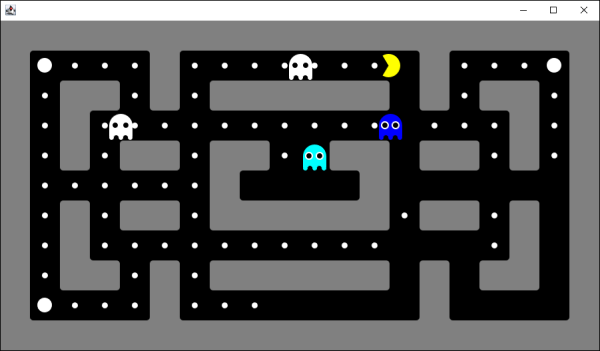

<h1>Pacman</h1>

Created in 2013 simple game implementation backed by graph algorithms.

You can either control Pacman manually, or let him save himself in two modes: thinking more or thinking less.

<h2>How to</h2>

Run the application via command <code>./gradlew run</code> from the project directory.

 

    

